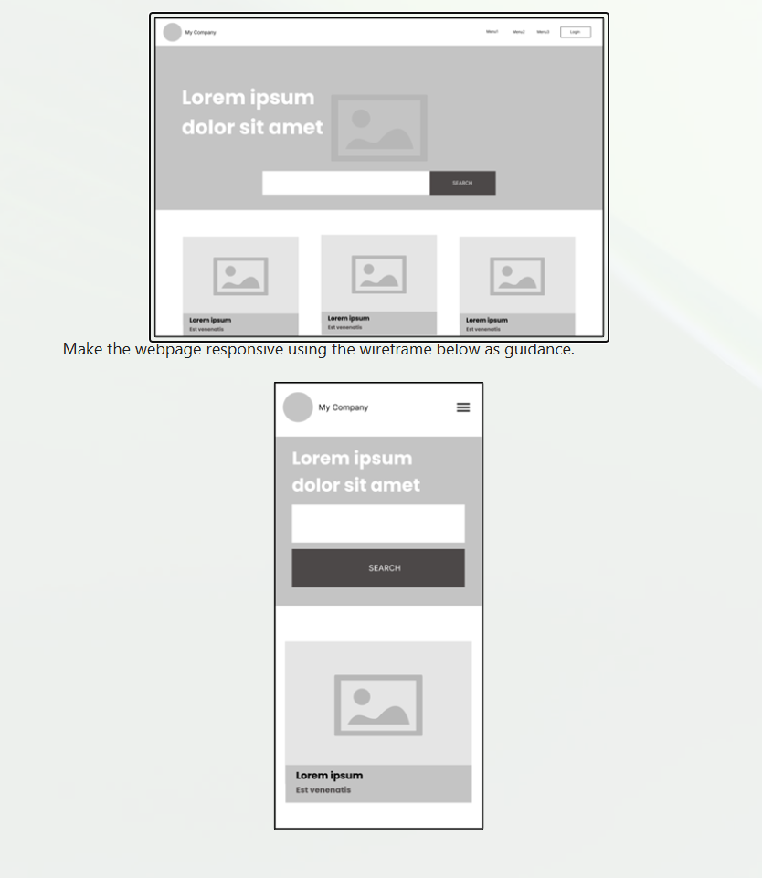

# Responsive Webpage Project
For mission 0 I was instructed to build a responsive page using a wireframe reference for Marketing Association NZ

This is the responsive webpage built using React. The layout adapts dynamically for various screen sizes, including mobile, tablet, and desktop devices.

## 🔗 Built With

- React

## 📱 Features

- Fully responsive layout
- Mobile, Tablet, Multiple screen layouts
- Auto adjust Service Library
- Auto adjust search bar 
- Absolute Zero Overflow

## 📐 Layout Behavior
Desktop:
- 720p, 1080p, 1440p compatible
- Clean layout with soft keyframe animation on load
- Auto adjusting grid and size for Service Library, resulting in a cleaner user experience

Tablet & Smartphone:
- Compatible with all Tablet & Smartphone sizes
- Hamburger menu implemented
- Cleaner stacked search bar
- Auto adjusted grid and size for Service Library, resulting in a cleaner user experience

## 🔍 How to View

1. Clone the repository
2. Run "npm run dev" in terminal then "ctrl left-click" the hyperlink in your browser.
3. Resize the browser window or use dev tools to test responsiveness.

